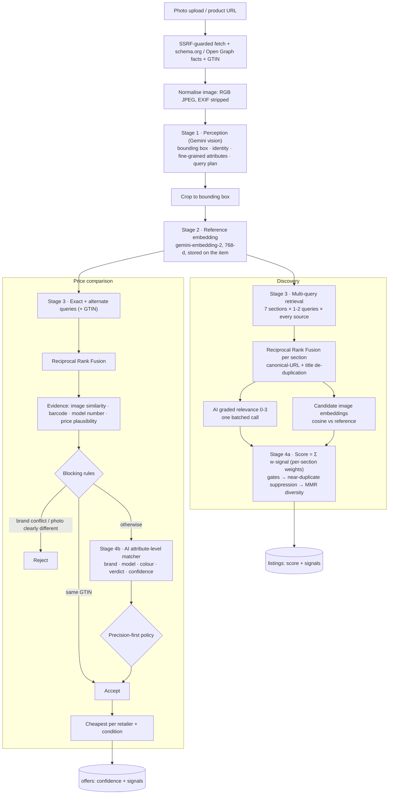

# Muse AI Layer

How Muse turns one photo or product link into (1) a ranked marketplace of similar items and
(2) a verified, cheapest-first price comparison. This document covers the architecture, the
industry practice each stage is modelled on, the calibration data behind every threshold, how
quality is measured, and what's left to build.

- [Design constraints](#design-constraints)
- [Architecture at a glance](#architecture-at-a-glance)
- [Stage 1: Perception](#stage-1-perception)
- [Stage 2: Visual representation](#stage-2-visual-representation)
- [Stage 3: Retrieval](#stage-3-retrieval)
- [Stage 4a: Discovery ranking](#stage-4a-discovery-ranking)
- [Stage 4b: Exact-product matching](#stage-4b-exact-product-matching)
- [Calibration](#calibration)
- [Failure handling and graceful degradation](#failure-handling-and-graceful-degradation)
- [Cost, quota and latency](#cost-quota-and-latency)
- [Evaluation](#evaluation)
- [Measured results](#measured-results)
- [Limitations and roadmap](#limitations-and-roadmap)
- [Code map](#code-map)
- [References](#references)

## Design constraints

Industry visual search (Pinterest Lens and Shop The Look, Amazon StyleSnap, Google Lens) is
built on a proprietary catalogue: detect the object, embed the crop, run approximate nearest
neighbour (ANN) search over billions of pre-embedded products, then re-rank. Muse has **no
catalogue** and runs **entirely on free tiers**:

| Constraint | Consequence for the design |
|---|---|
| No product index to search | Retrieval is *keyword search* over live sources (eBay Browse API, Tavily web search), so recall depends on good queries. The visual model is applied as a **re-ranker** over retrieved candidates rather than as the retriever. |
| Prices must be real | Prices come only from eBay's API or the retailer's own schema.org markup, never from model output. |
| Free-tier AI (Gemini) | Every stage batches its model calls (one grading call per search, one verification call per comparison, batched embeddings) and every model-dependent signal has a fallback. |
| CPU-only hosting (Railway) | No local vision models; embeddings come from `gemini-embedding-2` over the API. |

## Architecture at a glance



Every shown listing is persisted with its **score** and the **signals** that produced it
(`listings.score`, `listings.signals`), so any ranking or match decision can be explained and
audited after the fact, and the evaluation harness can score cached output.

## Stage 1: Perception

`ProductAI.analyze` (`app/services/ai.py`) sends the normalised image, plus product-page facts
when the item came from a link, to a vision-language model with a JSON schema. The output,
`ItemAnalysis`, has three groups of fields:

**Localisation.** `subject_box` is `[ymin, xmin, ymax, xmax]` on a 0-1000 scale, the format
Gemini is trained to emit for detection. Shoppers' photos include people, backgrounds and other
products. Industry pipelines detect before they embed (Pinterest's Shop The Look runs an object
detector and embeds each crop), because embedding the whole frame mixes the background into the
item's representation.

**Identity and fine-grained attributes.**
- The basics: `category`, `product_name`, `brand` with `brand_confidence`, `colors`, `materials`,
  `gender` and `price_tier`.
- `model_number` holds a style code such as `IE3437` when it's printed on the page or the item.
- `key_features` lists up to five details that separate this exact product from look-alikes
  ("heel pull tab with contrast seam", "gum rubber sole"). It feeds query building, relevance
  grading and matching.
- `visible_text` holds logos and printed text that can actually be read.

Brand grounding is conservative. Product-page facts count as evidence, not instructions.
Without them, a brand is named only when logos or signature design make it clear; otherwise it
is `null` and `unknown`.

**Search plan (query expansion).**
- `exact_match_query` plus `alternate_queries` are varied exact phrasings, for example without the
  colourway, or brand plus model number.
- `visual_query` describes the look with no brand, so it finds look-alikes from any seller.
- `aesthetic_queries` are three different items for the same shopper.
- `similar_brands` are three brands at a comparable aesthetic and price.

Every new field has a default, so analyses stored before the upgrade still load.

## Stage 2: Visual representation

`app/services/embeddings.py`, `app/services/imaging.py`

1. **Crop.** `crop_to_box` crops to the box, adding 8% of the box's own size as padding on each
   side so soles, straps and handles aren't clipped. The crop is skipped when the box covers
   more than 85% of the frame (it's already a product shot) or is implausibly small (under 5%
   of an edge).
2. **Embed.** The crop is downscaled to 512 px and embedded with `gemini-embedding-2` at 768
   dimensions, one of the model's recommended sizes, and stored as `items.image_embedding`.
   Items created before embeddings existed are backfilled the first time they're searched.
3. **Candidates.** `VisualSimilarity.score` downloads candidate images concurrently (8 at a
   time) through the same SSRF guard as user links, normalises them, and embeds them in batches
   of 24. Batches run concurrently.
4. **Cross-modal fallback.** `gemini-embedding-2` maps text and images into one space, so a
   candidate whose image can't be downloaded is compared through its **title** instead. The two
   comparisons live on different similarity scales, so each `Similarity` carries its `modality`
   and is calibrated separately (see [Calibration](#calibration)).

## Stage 3: Retrieval

`app/services/retrieval.py`, `app/services/sources/`

**Sources.**
- **eBay Browse API:** new and pre-owned, fixed-price listings only.
- **Tavily web search:** Muse reads every result page itself and keeps it only if the retailer's
  own schema.org data describes a product with a price, title and image. Articles, category
  pages and bot walls drop out.

**Query plan.**

| Intent | Queries | Why |
|---|---|---|
| Looks like this | `visual_query` + an attribute-built query (colour, material, key feature, category) | Two phrasings of the look widen recall for the most important section |
| Same aesthetic (×3) | one AI-written query each | Different items for the same shopper |
| Similar brand (×3) | `"{brand} {category}"` | Comparable brands, same kind of item |
| Price comparison | `exact_match_query` + one alternate, with the GTIN when known | Alternates recover listings titled differently from the original |

**Reciprocal Rank Fusion.** Each (query, source) pair returns its own ranked list. Scores
across lists aren't comparable (eBay's relevance and Tavily's aren't on one scale), so lists
are merged with RRF (Cormack, Clarke & Büttcher, SIGIR 2009), the standard choice for hybrid and
multi-channel search:

$$\text{rrf}(d) = \sum_{L \ni d} \frac{1}{k + \text{rank}_L(d)}, \quad k = 60$$

Listings that several queries *and* sources agree on rise to the top, and no single source's
long tail can crowd the pool. Each source is ranked independently within a query, so eBay's
first result and the web's first result both count as rank 1.

**Identity and de-duplication.** `canonical_url` lower-cases the host, drops `www.`, the
fragment, trailing slashes and ~40 tracking parameters (`utm_*`, `gclid`, `srsltid`, eBay's
`_trksid`…). It reduces eBay item URLs to their item id. Listings are also merged on (retailer,
normalised title), which catches one product under several colour or variant URLs. In discovery,
each product is assigned to the first section that found it, so it is never shown twice. The
shopper's own link is always excluded.

**Recall hygiene in the web source.**
- Tavily is asked for 20 results. A basic-depth search costs one credit whatever the count.
- Domains that are never product pages are excluded (social, editorial, review sites), as are
  aggregators and marketplaces that always block automated reads (Lyst, Etsy, DHgate, Amazon,
  Temu…). eBay is excluded too, because it's covered by its API. Excluding them frees result
  slots for readable stores.
- Result URLs are de-duplicated by canonical URL *before* pages are fetched. http, https and www
  variants of one page were each being read.
- Each page read has a 6-second budget with 10 concurrent reads, so one slow blog can't hold up
  the whole search.

## Stage 4a: Discovery ranking

`app/services/ranking.py`, `app/services/discover.py`

A retrieve-then-rank pipeline. Up to 20 fused candidates per section go through the full model.

### Signals

The AI grading call and the candidate embeddings run **concurrently**.

| Signal | Source | Normalisation |
|---|---|---|
| **visual** | cosine(candidate embedding, reference crop embedding) | Calibration window per modality: image `[0.60, 0.92]` → `[0, 1]`, title `[0.28, 0.50]` → `[0, 1]`, clamped |
| **semantic** | AI **graded relevance** 0-3 for the section it was found under (graded judgement, as in TREC-style relevance assessment) | `grade / 3` |
| **retrieval** | RRF score | divided by the section's best RRF |

The grading prompt gives the model the shopper's item as context: category, style, colours,
materials, key features, gender and price tier. It defines the grade scale per section type.
Accessories for other products, gift cards, random bundles, replicas and the shopper's exact
item are graded 0.

### Score

$$\text{score} = \frac{\sum_s w_s \cdot \text{signal}_s}{\sum_{s \,\in\, \text{available}} w_s}$$

| Section | w visual | w semantic | w retrieval | Rationale |
|---|---|---|---|---|
| Looks like this | **0.55** | 0.30 | 0.15 | The section's promise *is* visual similarity |
| Same aesthetic | 0.20 | **0.60** | 0.20 | Deliberately *different* items (a tote for a flat), so looking alike matters little |
| Similar brand | 0.35 | **0.45** | 0.20 | Right kind of item from the named brand, and ideally a similar look |

A signal that's unavailable, for example after an embedding quota error or when the grader
skipped a listing, has its weight redistributed across the others. The score stays on a 0-1
scale.

### Selection

1. **Gates.** AI grade 0 is removed. In *Looks like this*, a candidate whose **photo** scores
   below 0.64 cosine is removed as another category of item; weaker title evidence never gates.
2. **Near-duplicate suppression.** A candidate whose image embedding is ≥ 0.975 cosine to one
   already selected is the same product under another URL, and is skipped.
3. **Maximal Marginal Relevance** (Carbonell & Goldstein, SIGIR 1998) picks the top 12:

$$\text{MMR} = \arg\max_{d \in R \setminus S}\big[\lambda\cdot\text{score}(d) - (1-\lambda)\max_{s\in S}\cos(d,s)\big], \quad \lambda = 0.8$$

A high λ keeps relevance dominant. The research literature shows aggressive diversification
costs nDCG, so diversity here only breaks near-ties, so that a section isn't twelve copies of one look.

## Stage 4b: Exact-product matching

`app/services/matching.py`, `app/services/prices.py`

Price comparison is **entity matching**: deciding whether two offers describe the same
real-world product. The WDC Products benchmark (Peeters, Der & Bizer, 2023) shows where this is
hard: *corner cases*, meaning matches that look textually different and non-matches that
differ in a single attribute (one colourway, a knit instead of a leather upper). Muse follows
the standard **blocking → matching** structure, plus a decision policy.

### 1. Evidence

Computed for every priced candidate:

| Evidence | How | Passed to the matcher as |
|---|---|---|
| Image similarity | cosine vs the reference crop | `very_high` ≥ 0.92 · `high` ≥ 0.85 · `moderate` ≥ 0.75 · `low` (title-based evidence has its own cut-offs) |
| Barcode | GTIN equality, ignoring the UPC-A/EAN-13 leading zero | `same` / `different` / `unknown` |
| Model number | normalised style code found in the listing title | `true` / `false` / unknown |
| Price plausibility | price < 40% of the reference price (same currency), or of the pool median when there's no reference and ≥ 3 prices | `"73% below the typical price; possible replica"` |

### 2. Blocking rules

These settle obvious cases without spending AI quota:
- **Accept** on an identical GTIN.
- **Reject** on a brand conflict: both brands known and clearly different, *and* our brand absent
  from the listing title. Marketplace sellers often fill the brand field wrongly.
- **Reject** when the **photo** scores below 0.70 cosine and the model number isn't in the title.
  At that similarity it's another kind of item. Title similarity never triggers a reject.
- A *different* GTIN is **not** a reject, because each size of a product has its own barcode.
  It's passed to the matcher as evidence instead.

### 3. Attribute-level matcher

One batched AI call covers all remaining candidates. Following Peeters & Bizer's finding that
structured, attribute-wise reasoning improves LLM matching, the schema makes the model compare
**brand, model and colour** individually (`match` / `mismatch` / `unclear`) before giving a
`verdict` (`same_product` / `different_product` / `unsure`), a calibrated **confidence** (0-1)
and a short reason shown to shoppers. The prompt explains what each piece of evidence means and
tells the model to weigh it, not obey it.

### 4. Decision policy

A listing is accepted only if **all** of these hold:
- `verdict == same_product`;
- `confidence ≥ 0.7`;
- no attribute is `mismatch` (`unclear` is tolerated, since many titles omit the colour).

This policy is **precision-first** by design. A false positive puts a look-alike or a replica in
a price comparison and misleads the shopper; a false negative only hides one offer. Accepted
offers keep one row per retailer and condition (all eBay sellers count as one marketplace), and
are sorted by price plus shipping.

## Calibration

The embedding thresholds were measured on `gemini-embedding-2` (768-d) using real product photos
and real listings Muse had retrieved. Cosine similarity to the reference image:

| Pair | Observed cosine |
|---|---|
| Two different photos of the same product (Everlane Day Glove) | **0.99** |
| Same category, look-alike (other black leather ballet flats) | **0.70 – 0.87** |
| Same category, different brand and design (a Sector dive watch vs a Luminox watch) | 0.71 |
| Unrelated category (flats vs a watch; a watch vs a rain jacket) | **0.56 – 0.60** |
| Reference image vs listing **title** (same-category items) | 0.36 – 0.48 |
| Reference image vs listing **title** (unrelated) | 0.27 – 0.32 |

The thresholds follow directly from these bands:

| Constant | Value | Meaning |
|---|---|---|
| `IMAGE_WINDOW` | 0.60 – 0.92 | Visual signal runs from 0 (other category) to 1 (near-identical) |
| `TEXT_WINDOW` | 0.28 – 0.50 | The same, for title-based comparison |
| `VISUAL_SECTION_MIN_IMAGE_COSINE` | 0.64 | *Looks like this* gate |
| `NEAR_DUPLICATE_COSINE` | 0.975 | Same product under another URL |
| `IMAGE_SAME_PRODUCT` / `HIGH` / `MODERATE` | 0.92 / 0.85 / 0.75 | Evidence buckets for the matcher |
| `IMAGE_REJECT_BELOW` | 0.70 | Blocking rule for price comparison |
| `MIN_ACCEPT_CONFIDENCE` | 0.7 | Matcher decision policy |

> These values come from a small calibration set. Re-measure them whenever the embedding model
> or its dimensionality changes, and tune them against labelled judgements with the evaluation
> harness below.

## Failure handling and graceful degradation

| Failure | Behaviour |
|---|---|
| A source fails (quota, outage) | Other sources still return; only all sources failing is an error |
| A query fails | Other queries still fuse; only all queries failing is an error |
| Gemini model overloaded / rate-limited | Falls through `GEMINI_MODEL` → `GEMINI_FALLBACK_MODELS` |
| Reference or candidate embedding fails | Ranking continues without the visual signal (weights redistributed); matching skips the visual rule and evidence |
| Candidate image unreadable | Title embedding instead (cross-modal) |
| Relevance grading fails but visual signal exists | Discovery ranks on visual + retrieval instead of failing |
| No `GEMINI_API_KEY` (e.g. Claude provider without it) | Visual layer disabled; everything else works |
| Page read slower than 6 s | That page is skipped |

## Cost, quota and latency

Per item, on free tiers:

| Step | Gemini generation | Gemini embeddings | Tavily credits | eBay calls |
|---|---|---|---|---|
| Analyse | 1 | 1 (reference crop) | – | – |
| Discover | 1 (grading) | ≤ 6 batches (≤ 140 candidates) | 8 | 8 |
| Compare prices | 1 (matching) | 1-2 batches | 2 | 2 |

That is 1 more Tavily credit for discovery and 1 more for prices than the previous pipeline,
spent on query expansion for the two sections where recall matters most.

Latency was measured locally against live services on 2026-09-14:

| Step | Latency | Notes |
|---|---|---|
| Upload + analysis + crop + reference embedding | 17 s | |
| Discovery | 24 s | 53 retrieved, 42 ranked, 41 shown |
| Price comparison | 48 – 85 s | Dominated by Gemini itself: during an overload spike, the primary returned 503 and the first fallback used its full 60 s request timeout before the third model answered |

Page reads were 12.6 s → 9.2 s per Tavily query after the per-page budget.

## Evaluation

Quality is measured with standard information-retrieval and matching metrics
(`app/eval/metrics.py`):

| Task | Metric | Definition |
|---|---|---|
| Discovery ranking | **Precision@k** | Share of the top k with grade ≥ 2 |
| | **Recall@k** | Share of all known relevant results that appear in the top k |
| | **nDCG@k** | DCG with graded gains 2^g − 1 and log₂ discount, normalised by the ideal ordering of all judged results (Järvelin & Kekäläinen, 2002) |
| | **MRR** | 1 / rank of the first relevant result |
| | **MAP** | Mean average precision |
| Price matching | **Precision / Recall / F1** | Over (item, offer) pairs, against same-product labels |

### Workflow

```bash
cd backend
python -m app.eval template > judgements.jsonl   # every cached result, ready to label
# fill in "grade": 0-3 for discovery rows and "match": true/false for offers
python -m app.eval score judgements.jsonl         # prints the metric report as JSON
```

Judgements are keyed by canonical URL, so they survive tracking-parameter changes and can be
reused across pipeline versions. To compare a change (weights, thresholds, prompts, models):
1. Re-run discovery or prices with `?refresh=true` for the judged items.
2. Score again with the same judgements.
3. Label any new results, which `judged@k` reports.

Unjudged results count as grade 0, so the scores are conservative. Offers nobody labelled are
left out of precision.

### Telemetry

Every run logs its funnel under the `app` logger, visible in Railway logs:

```
discover item=… queries=8 retrieved=53 candidates=42 shown=41 visual=on 24.1s
prices item=… queries=2 candidates=4 rule_rejected=0 ai_checked=4 accepted=3 shown=2 84.5s
```

Every stored listing has `signals`, for example
`{"visual": 0.57, "visual_cosine": 0.78, "visual_modality": "image", "grade": 3, "rrf": 0.0164, "retrieval": 1.0}`,
or for offers the matcher's attributes and confidence.

## Measured results

These are observations from live runs during development, **not** a labelled benchmark. No
judgement set exists yet; creating one with the harness above is the first roadmap item. They
are reported as measured, including where the evidence is weak.

**Retrieval recall.** Same item, same AI query plan, new ranking in both runs:

| | Retrieved | Ranked | Shown |
|---|---|---|---|
| Before web-source recall fixes | 9 | 9 | 6 |
| After (20 results, excluded blockers, pre-fetch de-dup, page budget) | 44 – 53 | 29 – 42 | 28 – 41 |

In a single-query audit, 8 of 20 Tavily URLs had been aggregators or marketplaces that always
block, and several pages were one URL under http/https/www variants.

**Matching behaviour.** On the Everlane Day Glove, the matcher accepted the regular listing and
the *Narrow Fit* width variant, each with a stated reason. It rejected *The Day Glove in ReKnit*
(`model: mismatch`, textile upper vs leather) and held back a listing with no colour (`unsure`).
These are exactly the corner cases WDC Products describes.

**Visual coherence.** The mean image cosine of *Looks like this* results was 0.73 before and
0.72 after, so there's no measurable change on this proxy. The old pipeline had also shown the
shopper's own product inside an "aesthetic" section, which the new grading rubric scores 0.
Proper precision and nDCG figures need the labelled evaluation.

## Limitations and roadmap

1. **Labelled judgement set.** Label ~50 items across categories. Report P@10, nDCG@10 and
   matching F1 for every pipeline change, and tune the section weights and thresholds on it (a
   grid search over the weights is cheap because signals are stored).
2. **Learning to rank.** Once there are enough judgements or engagement events (clicks,
   wishlist saves, retailer click-outs), replace the hand-set linear weights with a learned
   ranker, such as a LambdaMART-style model over the stored signals.
3. **Own index for true visual retrieval.** Store candidate embeddings (`pgvector` with HNSW) as
   listings are seen. Repeat and popular categories can then retrieve by *image* ANN rather than
   keywords, which is the architecture of Pinterest and Amazon visual search.
4. **Domain-tuned embeddings.** Fashion-specific models (e.g. Marqo-FashionSigLIP, reported
   +57% recall@1 over FashionCLIP 2.0) separate fine details better than a general model, but
   need a GPU or paid hosting.
5. **Multi-object input.** Detect every item in an outfit photo and let the shopper pick one, as
   Shop The Look does, rather than assuming the most prominent one.
6. **Matcher robustness.** Add self-consistency (several samples, majority vote) or a second
   model as a judge for borderline confidences (0.6 – 0.8), where single-call LLM judgements are
   least reliable.
7. **Price normalisation.** Convert currencies before the plausibility check and the cheapest
   sort; today they're only compared within a currency.
8. **Latency.** Stream sections to the UI as each finishes, and cap the fallback model's request
   timeout when the primary is overloaded.

## Code map

| Concern | File |
|---|---|
| Perception, grading and matching prompts and schemas | `backend/app/services/ai.py` |
| Gemini / Claude providers (structured output, model fallback) | `backend/app/services/ai_gemini.py`, `ai_claude.py` |
| Image normalisation and bounding-box crop | `backend/app/services/imaging.py` |
| Multimodal embeddings, candidate similarity | `backend/app/services/embeddings.py` |
| Query execution, URL canonicalisation, RRF | `backend/app/services/retrieval.py` |
| Discovery ranking: calibration, scoring, gates, MMR | `backend/app/services/ranking.py` |
| Discovery pipeline | `backend/app/services/discover.py` |
| Matching evidence, blocking rules, decision policy | `backend/app/services/matching.py` |
| Price comparison pipeline | `backend/app/services/prices.py` |
| Sources (eBay Browse API, Tavily + schema.org reader) | `backend/app/services/sources/` |
| Metrics, report, CLI | `backend/app/eval/` |
| Tests for every stage | `backend/tests/test_ai_layer.py`, `test_eval.py`, `test_items_api.py` |

## References

- Cormack, Clarke & Büttcher. *Reciprocal Rank Fusion outperforms Condorcet and individual rank learning methods.* SIGIR 2009.
- Carbonell & Goldstein. *The use of MMR, diversity-based reranking for reordering documents and producing summaries.* SIGIR 1998.
- Järvelin & Kekäläinen. *Cumulated gain-based evaluation of IR techniques.* ACM TOIS, 2002.
- Jing et al. [*Visual Discovery at Pinterest*](https://arxiv.org/abs/1702.04680). WWW 2017.
- Shiau et al. [*Shop The Look: Building a Large Scale Visual Shopping System at Pinterest*](https://arxiv.org/abs/2006.10866). KDD 2020.
- Zhai et al. [*Learning a Unified Embedding for Visual Search at Pinterest*](https://arxiv.org/abs/1908.01707). KDD 2019.
- Peeters, Der & Bizer. [*WDC Products: A Multi-Dimensional Entity Matching Benchmark*](https://arxiv.org/abs/2301.09521). EDBT 2024.
- Peeters & Bizer. [*Entity Matching using Large Language Models*](https://arxiv.org/abs/2310.11244). EDBT 2025.
- Google. [*Gemini Embedding 2*](https://ai.google.dev/gemini-api/docs/embeddings) and [image understanding / object detection](https://ai.google.dev/gemini-api/docs/image-understanding) documentation.
- OpenSearch. [*Introducing reciprocal rank fusion for hybrid search*](https://opensearch.org/blog/introducing-reciprocal-rank-fusion-hybrid-search/).
- Marqo. [*Marqo-FashionCLIP and Marqo-FashionSigLIP*](https://github.com/marqo-ai/marqo-FashionCLIP).
